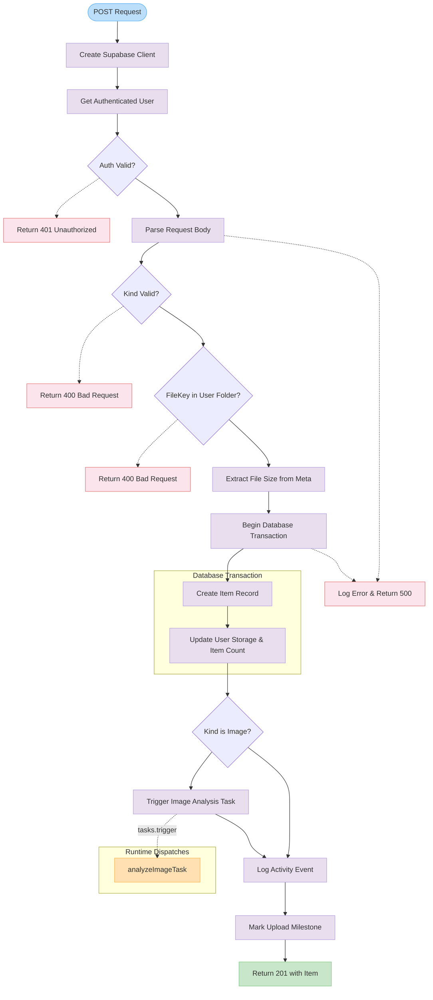

# POST

Creates a new item record in the database with optional file upload support. This function handles authentication, validates input parameters, performs storage quota updates, and triggers asynchronous processing tasks for image analysis and milestone tracking.

<details>
<summary>Visual Flow</summary>



</details>

<details>
<summary>Parameters</summary>

| Parameter | Type | Description |
|-----------|------|-------------|
| `request` | `NextRequest` | The incoming HTTP request object containing the item data in JSON format |

### Request Body Schema

The request body should contain a JSON object with the following optional properties:

- `kind`: `string` (optional) - The type of item being created. Must be a value from `allowedKinds` set if provided. Can be `null` for URL-sourced items during classification.
- `fileKey`: `string` (optional) - Storage key for uploaded files. Must be prefixed with the user's ID (`{userId}/`) if provided.
- `meta`: `object` (optional) - Metadata object containing file information including size for storage tracking.
- `sourceType`: `string` (optional) - Type of source for the item (e.g., "url", "upload").
- `sourceUrl`: `string` (optional) - URL of the source if the item was sourced from a web location.

</details>

<details>
<summary>Return Value</summary>

Returns a `NextResponse` object with one of the following:

**Success (201 Created):**
```typescript
{
  id: string;
  userId: string;
  kind: string | null;
  processingStatus: string;
  fileKey: string | null;
  meta: object | null;
  sourceType: string | null;
  sourceUrl: string | null;
  coverFileKey: string | null;
  createdAt: Date;
  updatedAt: Date;
}
```

**Error Responses:**
- `401 Unauthorized`: `{ message: "Unauthorized" }` - User not authenticated
- `400 Bad Request`: `{ message: "Kind must be valid if provided" }` - Invalid `kind` value
- `400 Bad Request`: `{ message: "File key must be in the user's folder" }` - Invalid `fileKey` path
- `500 Internal Server Error`: `{ message: "Internal server error" }` - Unexpected server error

</details>

<details>
<summary>Usage Examples</summary>

### Creating an Image Item with File Upload

```typescript
const response = await fetch('/api/v1/items', {
  method: 'POST',
  headers: {
    'Content-Type': 'application/json',
  },
  body: JSON.stringify({
    kind: 'image',
    fileKey: 'user123/uploads/photo.jpg',
    meta: {
      size: 1024000,
      contentType: 'image/jpeg',
      width: 1920,
      height: 1080
    },
    sourceType: 'upload'
  })
});

const item = await response.json();
```

### Creating a URL-Sourced Item

```typescript
const response = await fetch('/api/v1/items', {
  method: 'POST',
  headers: {
    'Content-Type': 'application/json',
  },
  body: JSON.stringify({
    sourceType: 'url',
    sourceUrl: 'https://example.com/content',
    meta: {
      title: 'Example Content',
      description: 'Content from external URL'
    }
  })
});

const item = await response.json();
```

### Creating an Item During Classification (No Kind)

```typescript
const response = await fetch('/api/v1/items', {
  method: 'POST',
  headers: {
    'Content-Type': 'application/json',
  },
  body: JSON.stringify({
    kind: null, // Will be classified later
    sourceType: 'url',
    sourceUrl: 'https://example.com/unknown-content'
  })
});

const item = await response.json();
```

</details>

<details>
<summary>Implementation Details</summary>

### Authentication & Authorization
- Uses Supabase authentication to verify the requesting user
- Ensures `fileKey` paths are scoped to the authenticated user's directory (`{userId}/`)

### Database Transaction
The function performs a database transaction that:
1. Creates a new `item` record with `processingStatus` set to `"processing"`
2. Increments the user's `itemCount`
3. Updates the user's `storageUsedBytes` if file size is available in metadata

### Storage Tracking
- Extracts file size from the `meta` object using `getFileSizeFromMeta()`
- Only increments storage usage if file size is greater than 0
- Storage updates are atomic within the database transaction

### Asynchronous Processing
- **Image Analysis**: Triggers `analyzeImageTask` for items with `kind: "image"` and a valid `fileKey`
- **Activity Logging**: Logs item creation activity asynchronously (fire-and-forget)
- **Milestone Tracking**: Marks the "upload_first_image" milestone for image items

### Error Handling
- All errors are logged with structured logging
- Server exceptions are captured for monitoring
- Database transaction failures automatically roll back changes
- Returns appropriate HTTP status codes for different error scenarios

</details>

<details>
<summary>Edge Cases</summary>

### Kind Validation
- `kind` parameter is optional and can be `null` for items that require classification
- If `kind` is provided, it must exist in the `allowedKinds` set
- URL-sourced items during classification typically have `kind: null`

### File Key Security
- `fileKey` validation ensures users can only create items for files in their own directory
- Empty or `null` `fileKey` values are allowed for non-file items
- File key format must be: `{userId}/path/to/file`

### Storage Calculation
- File size extraction from `meta` may return 0 if size information is unavailable
- Storage usage is only updated if a positive file size is detected
- Missing or malformed `meta` objects are handled gracefully

### Concurrent Operations
- Database transaction prevents race conditions in storage calculations
- User storage limits are not enforced in this endpoint (handled elsewhere)
- Multiple simultaneous item creations are properly isolated

### Task Dispatch Failures
- Image analysis task failures don't affect item creation success
- Task dispatch is non-blocking and returns immediately
- Failed task dispatches are logged but don't cause endpoint failure

</details>

<details>
<summary>Related</summary>

- `analyzeImageTask` - Asynchronous task for processing uploaded images
- `createClient()` - Supabase client factory for authentication
- `getFileSizeFromMeta()` - Utility for extracting file size from metadata
- `logActivity()` - Activity logging function
- `markMilestoneComplete()` - User milestone tracking
- `allowedKinds` - Set of valid item kind values
- Database models: `item`, `user`

</details>