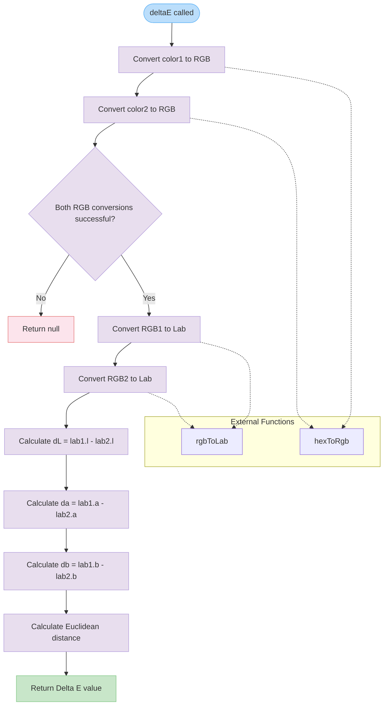

# deltaE

Calculates the Delta E (ΔE) color difference between two colors using the CIE Lab color space. This function converts hex color values to Lab coordinates and computes the Euclidean distance, providing a perceptually uniform measure of color difference.

<details>
<summary>Visual Flow</summary>



</details>

<details>
<summary>Parameters</summary>

- `color1`: `string` - The first color in hexadecimal format (e.g., "#FF0000" or "FF0000")
- `color2`: `string` - The second color in hexadecimal format (e.g., "#00FF00" or "00FF00")

</details>

<details>
<summary>Return Value</summary>

Returns `number | null`:
- `number` - The Delta E value representing the perceptual difference between the two colors. Lower values indicate more similar colors (0 = identical colors)
- `null` - Returned when either color cannot be parsed as a valid hexadecimal color

</details>

<details>
<summary>Usage Examples</summary>

```typescript
// Compare two similar reds
const difference1 = deltaE("#FF0000", "#FF1111");
console.log(difference1); // ~5.89

// Compare red and blue (very different)
const difference2 = deltaE("#FF0000", "#0000FF");
console.log(difference2); // ~113.4

// Compare identical colors
const difference3 = deltaE("#FFFFFF", "#FFFFFF");
console.log(difference3); // 0

// Handle invalid colors
const difference4 = deltaE("#INVALID", "#FF0000");
console.log(difference4); // null

// Colors without # prefix
const difference5 = deltaE("FF0000", "00FF00");
console.log(difference5); // Works if hexToRgb supports this format
```

</details>

<details>
<summary>Implementation Details</summary>

The function implements the CIE76 Delta E formula:

1. **Color Space Conversion**: Converts both hex colors to RGB, then to CIE Lab color space
2. **Lab Difference Calculation**: Computes differences in each Lab dimension:
   - `dL`: Lightness difference (L* axis)
   - `da`: Green-Red difference (a* axis) 
   - `db`: Blue-Yellow difference (b* axis)
3. **Euclidean Distance**: Calculates `√(dL² + da² + db²)` for the final Delta E value

The CIE Lab color space is designed to be perceptually uniform, meaning equal numerical differences correspond to roughly equal perceived color differences.

</details>

<details>
<summary>Edge Cases</summary>

- **Invalid Hex Colors**: Returns `null` if either color cannot be parsed by `hexToRgb()`
- **Identical Colors**: Returns exactly `0` for identical colors
- **Color Format Dependency**: Behavior with different hex formats (with/without #, 3-digit vs 6-digit) depends on the `hexToRgb()` implementation
- **Precision**: Results are floating-point numbers with precision dependent on the Lab conversion accuracy

**Delta E Interpretation Guidelines**:
- `0-1`: Colors are nearly identical
- `1-2`: Very slight difference (expert eye needed)
- `2-5`: Slight difference (trained eye can notice)
- `5-10`: Noticeable difference
- `>10`: Significant difference

</details>

<details>
<summary>Related</summary>

- `hexToRgb()` - Converts hexadecimal colors to RGB values
- `rgbToLab()` - Converts RGB colors to CIE Lab color space
- **CIE Delta E variants**: CIE94, CIE2000 (more complex but potentially more accurate formulas)
- **Color difference standards**: Used in printing, display calibration, and color matching applications

</details>