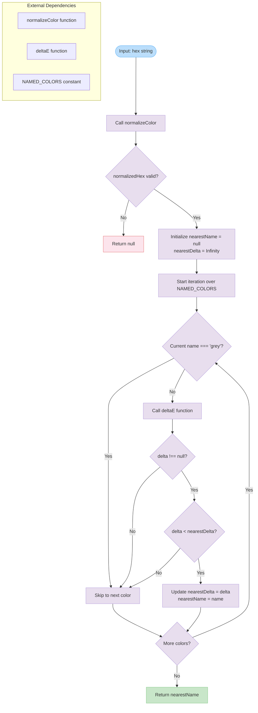

# getNearestColorName

Finds the closest matching named color for a given hexadecimal color value using Delta E color difference calculation. Returns the name of the nearest color from a predefined set of named colors, or `null` if the input is invalid.

<details>
<summary>Visual Flow</summary>



</details>

<details>
<summary>Parameters</summary>

- `hex` (`string`): A hexadecimal color string (e.g., `"#FF0000"`, `"red"`, `"rgb(255,0,0)"`) that will be normalized before processing

</details>

<details>
<summary>Return Value</summary>

Returns `string | null`:
- `string`: The name of the nearest matching color from the `NAMED_COLORS` collection
- `null`: If the input `hex` parameter cannot be normalized to a valid color format

</details>

<details>
<summary>Usage Examples</summary>

```typescript
// Find nearest color for a hex value
const nearest = getNearestColorName("#FF0000");
console.log(nearest); // "red"

// Find nearest color for an RGB value
const nearest2 = getNearestColorName("rgb(255, 0, 0)");
console.log(nearest2); // "red"

// Find nearest color for a slightly off-red
const nearest3 = getNearestColorName("#FE0100");
console.log(nearest3); // "red" (closest match)

// Invalid input
const invalid = getNearestColorName("not-a-color");
console.log(invalid); // null

// Find nearest for a complex color
const nearest4 = getNearestColorName("#7B68EE");
console.log(nearest4); // "mediumslateblue" (or closest match)
```

</details>

<details>
<summary>Implementation Details</summary>

The function implements a nearest-neighbor search algorithm using color perception-based distance calculation:

1. **Color Normalization**: Uses `normalizeColor()` to convert the input to a standardized format
2. **Delta E Calculation**: Employs the `deltaE()` function to calculate perceptual color differences between the input and each named color
3. **Minimum Distance Search**: Iterates through all named colors to find the one with the smallest Delta E value
4. **Grey Alias Handling**: Explicitly skips the "grey" entry since it's an alias for "gray" to avoid duplicate results
5. **Greedy Algorithm**: Uses a simple minimum-finding approach with `O(n)` complexity where `n` is the number of named colors

The Delta E calculation provides perceptually uniform color differences, making the results more aligned with human color perception than simple RGB distance calculations.

</details>

<details>
<summary>Edge Cases</summary>

- **Invalid Input**: Returns `null` for any input that `normalizeColor()` cannot process
- **Grey vs Gray**: The function deliberately skips "grey" entries to prevent returning the alias instead of the canonical "gray" name
- **Exact Matches**: When the input exactly matches a named color, that color name is returned with a Delta E of 0
- **Delta E Failures**: If `deltaE()` returns `null` for a particular color comparison, that color is skipped in the search
- **Empty Color Set**: If no valid comparisons can be made, returns `null`
- **Tie Breaking**: In case of identical Delta E values, the first encountered color in iteration order wins

</details>

<details>
<summary>Related</summary>

- `normalizeColor()`: Converts various color formats to a standardized representation
- `deltaE()`: Calculates perceptual color differences using the Delta E algorithm
- `NAMED_COLORS`: Constant containing the collection of named colors with their hex values
- Color conversion utilities for working with different color spaces (RGB, HSL, Lab)

</details>