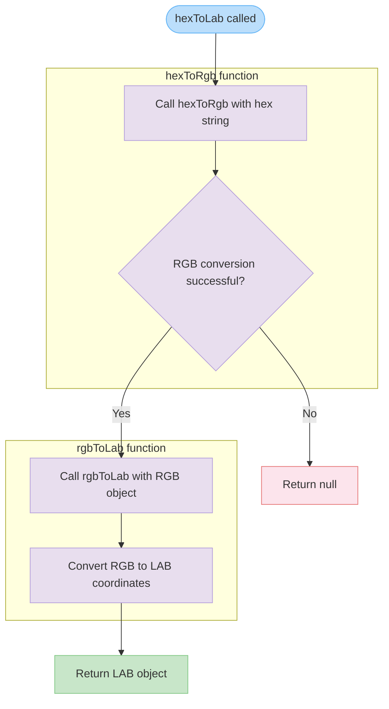

# hexToLab

Converts a hexadecimal color string to CIE LAB color space coordinates. This function provides a two-step conversion process, first transforming the hex color to RGB, then converting the RGB values to the LAB color space which is designed to be perceptually uniform.

<details>
<summary>Visual Flow</summary>



</details>

<details>
<summary>Parameters</summary>

| Parameter | Type | Description |
|-----------|------|-------------|
| `hex` | `string` | A hexadecimal color string (e.g., `"#FF0000"`, `"#f00"`, `"FF0000"`) |

</details>

<details>
<summary>Return Value</summary>

Returns `{ l: number; a: number; b: number } | null`

- **Success**: An object containing LAB color coordinates:
  - `l`: Lightness component (0-100)
  - `a`: Green-red color component (-128 to 127)
  - `b`: Blue-yellow color component (-128 to 127)
- **Failure**: `null` if the input hex string is invalid or cannot be parsed

</details>

<details>
<summary>Usage Examples</summary>

```typescript
// Convert standard hex colors
const redLab = hexToLab("#FF0000");
console.log(redLab); // { l: 53.24, a: 80.09, b: 67.20 }

const whiteLab = hexToLab("#FFFFFF");
console.log(whiteLab); // { l: 100, a: 0, b: 0 }

// Works with short hex format
const blueLab = hexToLab("#00F");
console.log(blueLab); // { l: 32.30, a: 79.19, b: -107.86 }

// Works without hash prefix
const greenLab = hexToLab("00FF00");
console.log(greenLab); // { l: 87.73, a: -86.18, b: 83.18 }

// Invalid input handling
const invalid = hexToLab("invalid");
console.log(invalid); // null

const invalidHex = hexToLab("#GGG");
console.log(invalidHex); // null
```

</details>

<details>
<summary>Implementation Details</summary>

The function implements a two-stage color conversion pipeline:

1. **Hex to RGB**: Delegates to `hexToRgb()` to parse the hexadecimal string and convert it to RGB values
2. **RGB to LAB**: Uses `rgbToLab()` to transform RGB coordinates to the CIE LAB color space

The LAB color space conversion typically involves:
- Converting RGB to linear RGB
- Transforming to XYZ color space (usually sRGB to CIE XYZ)
- Converting XYZ to LAB using the CIE standard formulas

This approach maintains separation of concerns by leveraging existing conversion functions rather than implementing the entire hex-to-LAB conversion in a single function.

</details>

<details>
<summary>Edge Cases</summary>

- **Invalid hex strings**: Returns `null` for malformed hex values (e.g., `"#GGG"`, `"xyz"`)
- **Empty or null input**: Behavior depends on `hexToRgb()` implementation
- **Case sensitivity**: Typically handled gracefully (both `"#FF0000"` and `"#ff0000"` should work)
- **Hash prefix optional**: Most implementations accept both `"#FF0000"` and `"FF0000"`
- **Short hex format**: Should support 3-digit hex codes like `"#F00"` expanded to `"#FF0000"`
- **Precision**: LAB values are floating-point numbers and may have decimal precision

</details>

<details>
<summary>Related</summary>

- `hexToRgb()` - Converts hex strings to RGB objects
- `rgbToLab()` - Converts RGB objects to LAB color space
- `labToHex()` - Reverse conversion from LAB to hex
- `hexToHsl()` - Alternative color space conversion
- CIE LAB color space documentation
- Color difference calculations (Delta E) that use LAB coordinates

</details>