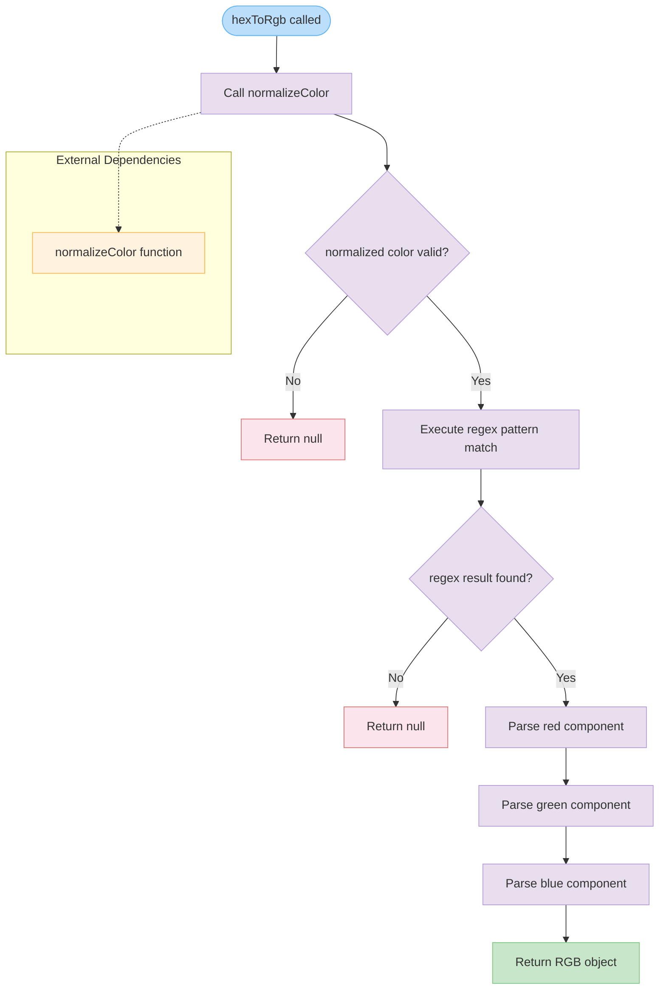

# hexToRgb

Converts a hexadecimal color string to an RGB object representation. This function parses standard hex color formats and returns the individual red, green, and blue channel values as integers from 0-255.

<details>
<summary>Visual Flow</summary>



</details>

<details>
<summary>Parameters</summary>

- `hex` (`string`) - The hexadecimal color string to convert. Can be in various formats that will be normalized by the `normalizeColor` function.

</details>

<details>
<summary>Return Value</summary>

Returns `{ r: number; g: number; b: number } | null`:
- **Success**: An object containing RGB values where each component (`r`, `g`, `b`) is an integer between 0-255
- **Failure**: `null` if the input cannot be normalized or doesn't match the expected hex color format

</details>

<details>
<summary>Usage Examples</summary>

```typescript
// Standard 6-digit hex color
const rgb1 = hexToRgb('#FF5733');
// Returns: { r: 255, g: 87, b: 51 }

// Lowercase hex color
const rgb2 = hexToRgb('#a0b2c3');
// Returns: { r: 160, g: 178, b: 195 }

// Invalid hex color
const rgb3 = hexToRgb('#invalid');
// Returns: null

// Color that fails normalization
const rgb4 = hexToRgb('not-a-color');
// Returns: null

// Using the result
const color = hexToRgb('#FF0000');
if (color) {
  console.log(`Red: ${color.r}, Green: ${color.g}, Blue: ${color.b}`);
  // Output: Red: 255, Green: 0, Blue: 0
}
```

</details>

<details>
<summary>Implementation Details</summary>

The function follows a two-stage validation process:

1. **Color Normalization**: Delegates to `normalizeColor()` to handle various input formats and convert them to a standard hex format
2. **Regex Parsing**: Uses the pattern `/^#([a-f\d]{2})([a-f\d]{2})([a-f\d]{2})$/i` to extract exactly three 2-character hex segments
3. **Value Conversion**: Each hex segment is parsed using `Number.parseInt(segment, 16)` with base 16 to convert to decimal

The regex pattern specifically matches:
- `^#` - Must start with hash symbol
- `([a-f\d]{2})` - Exactly 2 hex characters for red channel
- `([a-f\d]{2})` - Exactly 2 hex characters for green channel  
- `([a-f\d]{2})$` - Exactly 2 hex characters for blue channel
- `i` flag makes matching case-insensitive

</details>

<details>
<summary>Edge Cases</summary>

- **Invalid input formats**: Returns `null` for any input that `normalizeColor` cannot process
- **Short hex codes**: 3-digit hex codes (e.g., `#RGB`) must be handled by `normalizeColor` before reaching this function
- **Case insensitive**: Accepts both uppercase and lowercase hex digits due to regex `i` flag
- **Malformed hex**: Returns `null` for strings that look like hex colors but don't match the exact 6-character format after normalization
- **Empty/null input**: Behavior depends on `normalizeColor` implementation - likely returns `null`

</details>

<details>
<summary>Related</summary>

- `normalizeColor` - Dependency function that standardizes color input formats
- RGB to hex conversion functions (inverse operation)
- Color utility functions for HSL, HSV conversions
- Color validation and parsing utilities

</details>