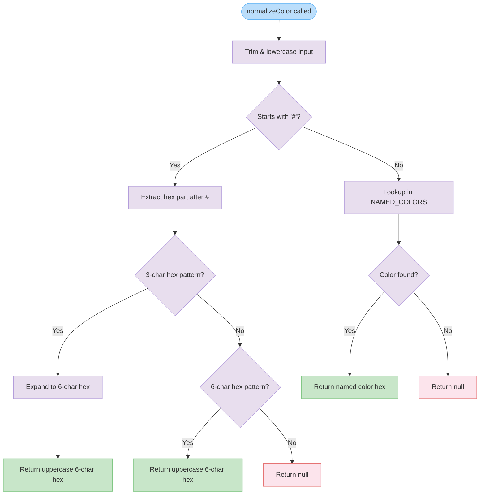

# normalizeColor

Normalizes color input strings to a standardized hexadecimal format. Supports both hexadecimal color codes (3-digit and 6-digit) and named color values, returning uppercase 6-digit hex codes or `null` for invalid inputs.

<details>
<summary>Visual Flow</summary>



</details>

<details>
<summary>Parameters</summary>

- `color`: `string` - The color value to normalize. Can be a hexadecimal color code (with `#` prefix) or a named color string. Leading/trailing whitespace and case variations are handled automatically.

</details>

<details>
<summary>Return Value</summary>

Returns `string | null`:
- `string`: A normalized uppercase 6-digit hexadecimal color code (e.g., `"#FF0000"`) when the input is valid
- `null`: When the input color format is invalid or unrecognized

</details>

<details>
<summary>Usage Examples</summary>

```typescript
// 3-digit hex expansion
normalizeColor("#f0a"); // Returns "#FF00AA"

// 6-digit hex normalization
normalizeColor("#ff0000"); // Returns "#FF0000"
normalizeColor("#AbC123"); // Returns "#ABC123"

// Named color lookup
normalizeColor("red"); // Returns hex value from NAMED_COLORS
normalizeColor("  BLUE  "); // Returns hex value (whitespace trimmed)

// Invalid inputs
normalizeColor("#xyz"); // Returns null
normalizeColor("#ff"); // Returns null (too short)
normalizeColor("#ff00000"); // Returns null (too long)
normalizeColor("invalidcolor"); // Returns null
normalizeColor(""); // Returns null
```

</details>

<details>
<summary>Implementation Details</summary>

The function processes color input through a two-stage validation pipeline:

1. **Input Sanitization**: Trims whitespace and converts to lowercase for consistent processing
2. **Format Detection**: Determines if input is hexadecimal (starts with `#`) or named color
3. **Hex Validation**: Uses regex patterns to validate hex format:
   - `/^[0-9a-f]{3}$/i` for 3-character hex codes
   - `/^[0-9a-f]{6}$/i` for 6-character hex codes
4. **3-Digit Expansion**: Converts shorthand hex (`#f0a`) to full format (`#ff00aa`) by duplicating each character
5. **Named Color Resolution**: Performs dictionary lookup in `NAMED_COLORS` constant for color name mapping

All valid hex outputs are converted to uppercase for consistency.

</details>

<details>
<summary>Edge Cases</summary>

- **Empty strings**: Returns `null` for empty or whitespace-only input
- **Invalid hex lengths**: 1, 2, 4, 5, 7+ character hex codes return `null`
- **Invalid hex characters**: Non-hexadecimal characters (g-z) in hex codes return `null`
- **Case sensitivity**: Input case is ignored - `"RED"`, `"red"`, and `"Red"` are treated identically
- **Whitespace handling**: Leading/trailing spaces are automatically trimmed
- **Missing `#` prefix**: Non-hex inputs without `#` are treated as potential named colors
- **NAMED_COLORS dependency**: Function relies on external `NAMED_COLORS` constant - missing or undefined constant will cause runtime errors

</details>

<details>
<summary>Related</summary>

- `NAMED_COLORS`: External constant containing color name to hex mappings
- Color validation utilities that may use this function for input normalization
- CSS color parsing libraries for more comprehensive color format support

</details>