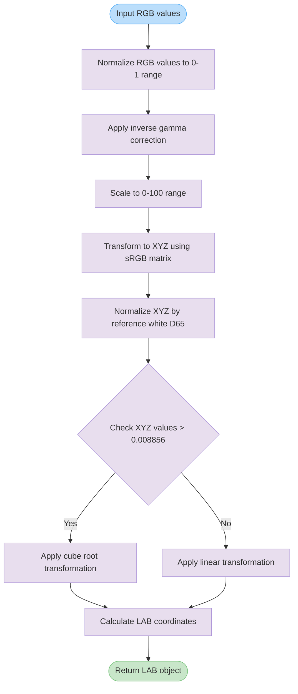

# rgbToLab

Converts RGB color values to CIE LAB color space using the sRGB color profile and D65 illuminant. The function performs gamma correction, transforms RGB to XYZ color space, then converts XYZ to LAB coordinates for perceptually uniform color representation.

<details>
<summary>Visual Flow</summary>



</details>

<details>
<summary>Parameters</summary>

- `rgb`: Object containing RGB color components
  - `r`: Red component (0-255)
  - `g`: Green component (0-255)
  - `b`: Blue component (0-255)

</details>

<details>
<summary>Return Value</summary>

Returns an object with CIE LAB color coordinates:
- `l`: Lightness component (0-100, where 0 is black and 100 is white)
- `a`: Green-red color component (negative values are green, positive are red)
- `b`: Blue-yellow color component (negative values are blue, positive are yellow)

</details>

<details>
<summary>Usage Examples</summary>

```typescript
// Convert pure red
const redLab = rgbToLab({ r: 255, g: 0, b: 0 });
console.log(redLab); // { l: 53.24, a: 80.09, b: 67.20 }

// Convert white
const whiteLab = rgbToLab({ r: 255, g: 255, b: 255 });
console.log(whiteLab); // { l: 100, a: 0, b: 0 }

// Convert black
const blackLab = rgbToLab({ r: 0, g: 0, b: 0 });
console.log(blackLab); // { l: 0, a: 0, b: 0 }

// Convert a custom color
const customLab = rgbToLab({ r: 128, g: 64, b: 192 });
console.log(customLab); // { l: 38.65, a: 44.12, b: -58.74 }
```

</details>

<details>
<summary>Implementation Details</summary>

The conversion process follows the standard RGB to LAB color space transformation:

1. **RGB Normalization**: Input RGB values (0-255) are normalized to the range 0-1
2. **Gamma Correction**: Applies inverse sRGB gamma correction using the standard formula:
   - If value > 0.04045: `((value + 0.055) / 1.055)^2.4`
   - Otherwise: `value / 12.92`
3. **RGB to XYZ**: Uses the sRGB to XYZ transformation matrix with D65 illuminant:
   - X = 0.4124R + 0.3576G + 0.1805B
   - Y = 0.2126R + 0.7152G + 0.0722B  
   - Z = 0.0193R + 0.1192G + 0.9505B
4. **XYZ Normalization**: XYZ values are normalized by D65 reference white values:
   - Xn = 95.047, Yn = 100.0, Zn = 108.883
5. **XYZ to LAB**: Applies the CIE LAB transformation with threshold at 0.008856:
   - If value > 0.008856: `value^(1/3)`
   - Otherwise: `7.787 * value + 16/116`
6. **LAB Calculation**: Final LAB coordinates are computed using standard formulas

</details>

<details>
<summary>Edge Cases</summary>

- **Out of Range RGB**: Function doesn't validate input ranges. RGB values outside 0-255 will produce mathematically valid but potentially unexpected LAB results
- **Negative RGB**: Negative RGB values will be processed but may produce invalid color representations
- **Floating Point Precision**: Very small RGB values near 0 may introduce minor floating-point precision artifacts in the final LAB coordinates
- **Gamma Correction Threshold**: The 0.04045 threshold in gamma correction is critical - values at this boundary may show slight discontinuities due to floating-point precision

</details>

<details>
<summary>Related</summary>

- `labToRgb()` - Inverse function to convert LAB back to RGB
- `rgbToHsl()` - Alternative RGB color space conversion
- `deltaE()` - Calculate perceptual color difference using LAB coordinates
- `rgbToXyz()` - Intermediate conversion step exposed as separate function

</details>