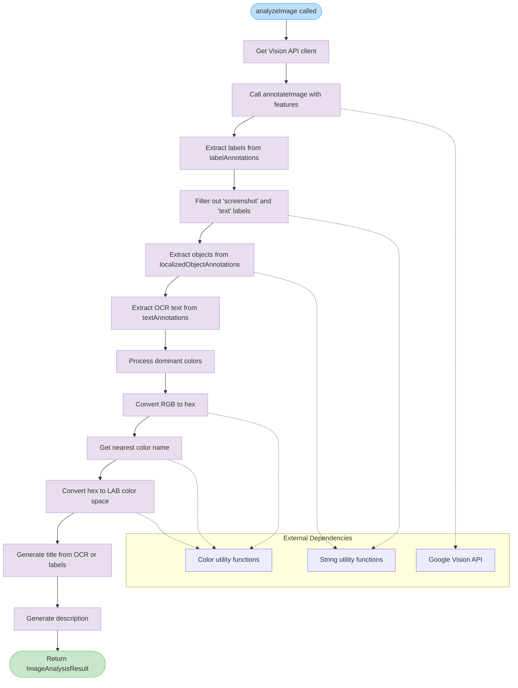

# analyzeImage

Performs comprehensive image analysis using Google Vision API to extract labels, objects, text, and color information. The function processes raw image data and returns structured metadata including OCR text, dominant colors with perceptual color matching data, and semantic descriptions.

<details>
<summary>Visual Flow</summary>



</details>

<details>
<summary>Parameters</summary>

### `imageBuffer: Buffer`
Raw image data as a Node.js Buffer. Supports common image formats including JPEG, PNG, GIF, BMP, WebP, and ICO. The buffer should contain valid image data that can be processed by Google Vision API.

</details>

<details>
<summary>Return Value</summary>

Returns `Promise<ImageAnalysisResult>` with the following structure:

```typescript
interface ImageAnalysisResult {
  title?: string;           // OCR-derived title or top 3 labels joined
  description: string;      // Generated description from analysis
  tags: string[];          // Filtered semantic labels
  objects: string[];       // Detected physical objects
  ocrText: string | null;  // Extracted text content
  colors: ImageColor[];    // Dominant colors with LAB values
  visionData: any;         // Complete Vision API response
}

interface ImageColor {
  hex: string;             // Hex color code (#RRGGBB)
  name: string;            // Human-readable color name
  score: number;           // Confidence score (0-1)
  l?: number;              // LAB lightness (0-100)
  a?: number;              // LAB a* component (-128 to 127)
  b?: number;              // LAB b* component (-128 to 127)
}
```

</details>

<details>
<summary>Usage Examples</summary>

### Basic Image Analysis

```typescript
import fs from 'fs';
import { analyzeImage } from './vision-service';

// Analyze a local image file
const imageBuffer = fs.readFileSync('screenshot.png');
const result = await analyzeImage(imageBuffer);

console.log('Title:', result.title);
console.log('Tags:', result.tags);
console.log('Colors:', result.colors.map(c => c.name));
```

### Processing User Upload

```typescript
import { analyzeImage } from './vision-service';

async function handleImageUpload(uploadedFile: Express.Multer.File) {
  try {
    const analysis = await analyzeImage(uploadedFile.buffer);
    
    // Use extracted metadata
    const metadata = {
      title: analysis.title || 'Untitled Image',
      description: analysis.description,
      searchTags: analysis.tags,
      dominantColors: analysis.colors.slice(0, 3),
      containsText: analysis.ocrText !== null
    };
    
    return metadata;
  } catch (error) {
    console.error('Image analysis failed:', error);
    throw error;
  }
}
```

### Color-Based Search Preparation

```typescript
const result = await analyzeImage(imageBuffer);

// Pre-computed LAB values enable efficient color similarity search
const colorData = result.colors.map(color => ({
  name: color.name,
  hex: color.hex,
  lab: { l: color.l, a: color.a, b: color.b }
}));

// Store for later perceptual color matching
await saveColorProfile(imageId, colorData);
```

</details>

<details>
<summary>Implementation Details</summary>

### Vision API Features
The function requests four specific analysis types from Google Vision API:
- `LABEL_DETECTION`: Identifies general concepts and themes (max 20 results)
- `OBJECT_LOCALIZATION`: Detects concrete physical objects (max 10 results)  
- `TEXT_DETECTION`: Performs OCR text extraction
- `IMAGE_PROPERTIES`: Extracts dominant colors and properties

### Label Filtering
Labels are filtered to remove common noise terms:
- Excludes "screenshot" and "text" labels
- Applies `uniqueStrings()` deduplication
- Preserves semantic relevance for search and categorization

### Color Processing Pipeline
1. **RGB Extraction**: Gets RGB values from Vision API color data
2. **Hex Conversion**: Converts RGB to hex format using `rgbToHex()`
3. **Name Mapping**: Maps hex codes to human-readable names via `getNearestColorName()`
4. **LAB Conversion**: Pre-computes LAB color space values using `hexToLab()`
5. **Filtering**: Removes colors with "unknown" names

### Title Generation Strategy
Prioritizes OCR-extracted titles using `getOcrTitle()` for text-heavy images, falling back to the top 3 filtered labels joined with commas for semantic relevance.

### Data Preservation
The complete Vision API response is stored in `visionData` as a deep clone, enabling future reprocessing or debugging without additional API calls.

</details>

<details>
<summary>Edge Cases</summary>

### Empty or Invalid Images
- Returns empty arrays for `tags`, `objects`, and `colors` if Vision API finds no content
- `ocrText` will be `null` if no text is detected
- `title` may be `undefined` if no meaningful content is found

### Vision API Limitations  
- Very small images may produce limited results
- Low-quality or heavily compressed images may have reduced accuracy
- Some image formats may not be fully supported despite being valid

### Color Detection Edge Cases
- Images with very similar colors may have fewer distinct color entries
- Monochrome or low-saturation images may not provide useful color data
- Color names are approximations and may not match human perception exactly

### OCR Text Handling
- Complex layouts or overlapping text may not extract cleanly
- Non-Latin scripts may have varying accuracy
- Very small or stylized text may not be detected

### Memory Considerations
- Large image buffers combined with extensive Vision API responses may consume significant memory
- The `visionData` field contains the complete API response and can be substantial for complex images

</details>

<details>
<summary>Related</summary>

### Dependencies
- `getVisionClient()`: Initializes Google Vision API client
- `rgbToHex()`: Color format conversion utility
- `getNearestColorName()`: Maps hex colors to human-readable names
- `hexToLab()`: Converts hex to LAB color space for perceptual matching
- `uniqueStrings()`: String array deduplication
- `getOcrTitle()`: Extracts meaningful titles from OCR text
- `generateDescription()`: Creates semantic descriptions from analysis data

### Related Functions
- Image preprocessing utilities for format conversion
- Color similarity search functions that use LAB values
- Content indexing systems that consume the analysis results
- Batch processing functions for multiple image analysis

### External APIs
- Google Vision API for core image analysis capabilities
- Color naming databases for human-readable color identification

</details>