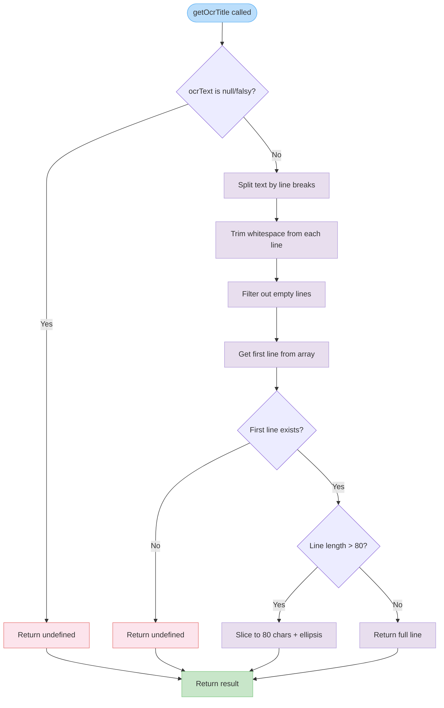

# getOcrTitle

Extracts and formats a title from OCR text by taking the first non-empty line. The function handles truncation of long titles and returns `undefined` for invalid or empty input.

<details>
<summary>Visual Flow</summary>



</details>

<details>
<summary>Parameters</summary>

- `ocrText`: `string | null` - The OCR-extracted text to process. Can be `null` for cases where OCR failed or no text was detected.

</details>

<details>
<summary>Return Value</summary>

Returns `string | undefined`:
- `string` - The formatted title (first non-empty line, truncated to 80 characters if necessary)
- `undefined` - When input is `null`, empty, or contains no valid lines

</details>

<details>
<summary>Usage Examples</summary>

```typescript
// Basic usage with multi-line text
const ocrResult = "Document Title\nThis is the body content\nMore text here";
const title = getOcrTitle(ocrResult);
console.log(title); // "Document Title"

// Handling null input
const noText = getOcrTitle(null);
console.log(noText); // undefined

// Long title truncation
const longText = "This is a very long title that exceeds eighty characters and will be truncated\nBody content";
const truncated = getOcrTitle(longText);
console.log(truncated); // "This is a very long title that exceeds eighty characters and will be trunca…"

// Text with leading/trailing whitespace
const messyText = "   \n  \n   Clean Title   \n\nBody content";
const clean = getOcrTitle(messyText);
console.log(clean); // "Clean Title"

// Empty lines only
const emptyLines = "\n   \n  \t  \n";
const empty = getOcrTitle(emptyLines);
console.log(empty); // undefined
```

</details>

<details>
<summary>Implementation Details</summary>

The function processes OCR text through several steps:

1. **Input validation**: Returns `undefined` immediately for falsy input
2. **Line splitting**: Uses regex `/\r?\n/` to handle both Unix (`\n`) and Windows (`\r\n`) line endings
3. **Normalization**: Trims whitespace from each line using `trim()`
4. **Filtering**: Removes empty lines with `filter(Boolean)`
5. **Selection**: Takes the first remaining line (`[0]`)
6. **Truncation**: If the line exceeds 80 characters, slices to 80 and appends an ellipsis (`…`)

The regex `/\r?\n/` ensures cross-platform compatibility by matching optional carriage returns followed by line feeds.

</details>

<details>
<summary>Edge Cases</summary>

- **Null input**: Returns `undefined` without throwing errors
- **Empty string**: Returns `undefined` after processing
- **Whitespace-only input**: Returns `undefined` after trimming and filtering
- **Single line exactly 80 characters**: Returns the full line without truncation
- **Single line 81+ characters**: Truncates to 80 characters and adds ellipsis
- **Mixed line endings**: Handles both `\r\n` (Windows) and `\n` (Unix/Mac) correctly
- **Lines with only whitespace**: Filtered out during processing
- **Unicode characters**: Counted as single characters for length calculation

</details>

<details>
<summary>Related</summary>

This function is commonly used in OCR processing pipelines alongside:
- Text extraction functions that produce the input `ocrText`
- Document processing workflows that need readable titles
- Content management systems that display OCR results
- File naming utilities that use extracted titles

</details>