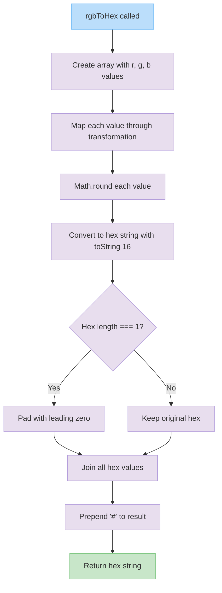

# rgbToHex

Converts RGB color values to a hexadecimal color string. Takes three numeric parameters representing red, green, and blue color channels and returns a hex color string prefixed with "#".

<details>
<summary>Visual Flow</summary>



</details>

<details>
<summary>Parameters</summary>

- `r` (`number`) - Red color channel value (typically 0-255)
- `g` (`number`) - Green color channel value (typically 0-255)  
- `b` (`number`) - Blue color channel value (typically 0-255)

</details>

<details>
<summary>Return Value</summary>

Returns a `string` representing the hexadecimal color value in the format `"#rrggbb"`, where each color channel is represented by two hexadecimal digits.

</details>

<details>
<summary>Usage Examples</summary>

```typescript
// Standard RGB values
const red = rgbToHex(255, 0, 0);
console.log(red); // "#ff0000"

const green = rgbToHex(0, 255, 0);
console.log(green); // "#00ff00"

const blue = rgbToHex(0, 0, 255);
console.log(blue); // "#0000ff"

// Mixed colors
const purple = rgbToHex(128, 0, 128);
console.log(purple); // "#800080"

const white = rgbToHex(255, 255, 255);
console.log(white); // "#ffffff"

// Low values (demonstrating zero padding)
const darkColor = rgbToHex(1, 2, 3);
console.log(darkColor); // "#010203"
```

</details>

<details>
<summary>Implementation Details</summary>

The function works by:

1. Creating an array from the three RGB parameters: `[r, g, b]`
2. Mapping each value through a transformation function that:
   - Rounds the value using `Math.round()` to handle decimal inputs
   - Converts to hexadecimal using `toString(16)`
   - Pads single-digit hex values with a leading zero for consistent formatting
3. Joining all hex values into a single string
4. Prepending the "#" symbol to create a valid CSS hex color

The zero-padding ensures that each color channel always occupies exactly two characters in the final hex string, maintaining the standard 6-character hex color format.

</details>

<details>
<summary>Edge Cases</summary>

- **Decimal values**: Input values are rounded to nearest integer using `Math.round()`
- **Negative values**: Will be rounded and converted to hex (may produce unexpected results)
- **Values > 255**: Will be converted to hex but may not represent valid RGB colors
- **Single-digit hex values**: Automatically padded with leading zero (e.g., `5` becomes `"05"`)
- **Zero values**: Correctly handled and padded (e.g., `0` becomes `"00"`)

**Note**: This function does not validate that RGB values are within the standard 0-255 range. Values outside this range will still be processed but may not produce meaningful color representations.

</details>

<details>
<summary>Related</summary>

- `hexToRgb()` - Reverse conversion from hex to RGB values
- `hslToRgb()` - Convert HSL color values to RGB
- CSS `rgb()` function - Native CSS function for RGB colors
- HTML color specifications and web color standards

</details>