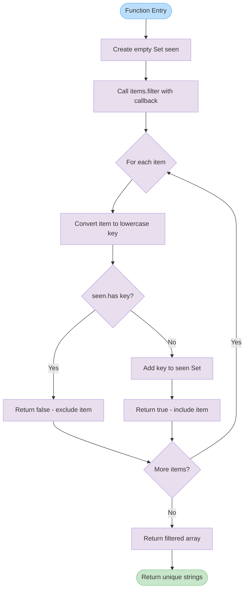

# uniqueStrings

Returns a new array containing unique strings from the input array, preserving the first occurrence of each string while performing case-insensitive deduplication. The original order of first occurrences is maintained in the result.

<details>
<summary>Visual Flow</summary>



</details>

<details>
<summary>Parameters</summary>

- `items`: `string[]` - An array of strings to deduplicate. Can contain duplicates with varying cases.

</details>

<details>
<summary>Return Value</summary>

Returns `string[]` - A new array containing unique strings from the input, with case-insensitive deduplication applied. The first occurrence of each unique string (by lowercase comparison) is preserved in its original case and position.

</details>

<details>
<summary>Usage Examples</summary>

```typescript
// Basic deduplication
const result1 = uniqueStrings(['apple', 'banana', 'apple', 'cherry']);
console.log(result1); // ['apple', 'banana', 'cherry']

// Case-insensitive deduplication
const result2 = uniqueStrings(['Apple', 'BANANA', 'apple', 'Banana']);
console.log(result2); // ['Apple', 'BANANA']

// Empty array handling
const result3 = uniqueStrings([]);
console.log(result3); // []

// Single item
const result4 = uniqueStrings(['hello']);
console.log(result4); // ['hello']

// Mixed case duplicates
const result5 = uniqueStrings(['Test', 'test', 'TEST', 'Other', 'other']);
console.log(result5); // ['Test', 'Other']
```

</details>

<details>
<summary>Implementation Details</summary>

The function uses a `Set<string>` to track previously seen strings in their lowercase form for efficient O(1) lookup operations. The implementation:

1. Creates an empty `Set` called `seen` to store lowercase versions of encountered strings
2. Uses `Array.filter()` to iterate through each item in the input array
3. For each item, converts it to lowercase using `item.toLowerCase()` to create a comparison key
4. Checks if the lowercase key already exists in the `seen` Set
5. If the key exists, returns `false` to exclude the item from the result
6. If the key doesn't exist, adds it to the `seen` Set and returns `true` to include the item

The time complexity is O(n) where n is the length of the input array, and space complexity is O(k) where k is the number of unique strings (case-insensitive).

</details>

<details>
<summary>Edge Cases</summary>

- **Empty array**: Returns an empty array `[]`
- **All duplicates**: Returns array with single item (the first occurrence)
- **Unicode characters**: Relies on JavaScript's `toLowerCase()` implementation for Unicode handling
- **Locale-specific casing**: Uses default locale for case conversion; may not handle all international casing rules correctly
- **Whitespace**: Treats strings with different whitespace as different items (no trimming performed)
- **Empty strings**: Empty strings `""` are treated as valid items and follow the same deduplication rules

```typescript
// Edge case examples
uniqueStrings(['', '', 'test']); // ['', 'test']
uniqueStrings(['  hello  ', 'hello']); // ['  hello  ', 'hello'] - whitespace preserved
uniqueStrings(['Ñ', 'ñ']); // ['Ñ'] - Unicode case folding applied
```

</details>

<details>
<summary>Related</summary>

- `Array.filter()` - Core method used for filtering duplicates
- `Set.has()` and `Set.add()` - Used for efficient duplicate detection
- `String.toLowerCase()` - Used for case-insensitive comparison
- Similar utility functions: `Array.from(new Set(items))` for case-sensitive deduplication

</details>