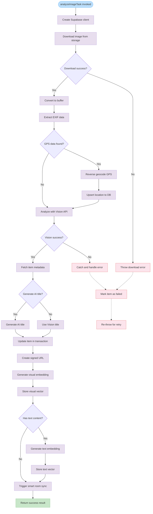

# analyzeImageTask

A Trigger.dev task that performs comprehensive image analysis including vision AI processing, EXIF data extraction, embedding generation, and database updates. The task downloads images from Supabase storage, analyzes them with Google Cloud Vision API, generates AI-powered titles, creates vector embeddings, and triggers smart room synchronization.

<details>
<summary>Visual Flow</summary>



</details>

<details>
<summary>Parameters</summary>

The task accepts an `AnalyzeImagePayload` object with the following properties:

- `itemId`: `string` - Unique identifier for the item being analyzed
- `userId`: `string` - User ID for multi-tenant isolation and ownership
- `fileKey`: `string` - Storage key/path for the image file in Supabase storage

</details>

<details>
<summary>Return Value</summary>

Returns a Promise that resolves to an object containing:

```typescript
{
  success: true,
  itemId: string,
  analysis: {
    title: string,           // Final title (AI-generated or Vision-derived)
    description: string,     // Image description from Vision API
    tagCount: number,        // Number of tags identified
    objectCount: number,     // Number of objects detected
    hasOcr: boolean,         // Whether OCR text was found
    colorCount: number       // Number of dominant colors identified
  },
  embeddings: {
    visualVectorId: string | null,  // ID of stored visual embedding
    textVectorId: string | null     // ID of stored text embedding (if applicable)
  }
}
```

On error, the task throws an exception after marking the item as failed in the database.

</details>

<details>
<summary>Usage Examples</summary>

```typescript
// Trigger the task for image analysis
await tasks.trigger<typeof analyzeImageTask>("analyze-image", {
  itemId: "item_123",
  userId: "user_456", 
  fileKey: "uploads/2024/image.jpg"
});

// The task can also be triggered from other tasks
await analyzeImageTask.trigger({
  itemId: item.id,
  userId: session.user.id,
  fileKey: uploadResult.path
});

// Access task configuration
console.log(analyzeImageTask.id); // "analyze-image"
console.log(analyzeImageTask.maxDuration); // 600 seconds
```

</details>

<details>
<summary>Implementation Details</summary>

The task executes the following processing pipeline:

**1. Image Download**
- Creates Supabase client with service role permissions
- Downloads image from the `items` storage bucket
- Converts blob response to Buffer for processing

**2. EXIF Data Extraction**
- Extracts GPS coordinates and capture date from image metadata
- Performs reverse geocoding if GPS data is present
- Stores location information in `itemLocation` table with `exif` source

**3. Vision API Analysis**
- Processes image with Google Cloud Vision API via `analyzeImage()` function
- Extracts objects, labels, OCR text, colors, and generates initial description
- Combines Vision analysis with original filename for AI title generation

**4. AI Title Enhancement**
- Uses `generateAITitle()` to create contextual titles based on:
  - Original filename
  - Detected labels and objects
  - OCR text content
- Falls back to Vision-derived title if AI generation fails

**5. Database Updates**
- Updates `Item` table with title, description, tags, and processing status
- Creates/updates `ItemImageDetails` with objects, OCR text, colors, and Vision data
- Uses database transactions to ensure consistency

**6. Embedding Generation**
- Creates signed URL for image access (1 hour validity)
- Generates visual embedding using CLIP model via Replicate
- Creates text embedding from combined tags, objects, and OCR text
- Stores embeddings in vector tables for similarity search

**7. Smart Room Sync**
- Triggers `syncItemToRoomsTask` to update smart room classifications
- Enables automatic categorization based on analysis results

</details>

<details>
<summary>Edge Cases</summary>

**Missing or Corrupted Images**
- Throws descriptive error if image download fails
- Handles blob conversion errors gracefully

**EXIF Data Variations**
- Safely processes images without GPS or date information
- Deletes existing EXIF location records if no GPS data found
- Handles reverse geocoding API failures without stopping analysis

**Vision API Limitations** 
- Continues processing even if some Vision features fail
- Handles empty or minimal analysis results
- Provides fallback titles when AI generation returns null

**Large Images**
- 10-minute timeout accommodates processing of high-resolution images
- Buffer size is logged for monitoring storage efficiency

**Text Content Edge Cases**
- Skips text embedding generation if no text content is extracted
- Handles OCR text with special characters or formatting
- Combines multiple text sources (tags, objects, OCR) intelligently

**Multi-tenant Isolation**
- All database operations include `userId` constraints
- Prevents cross-tenant data access in shared database

**Retry Behavior**
- Marks items as `failed` status before re-throwing errors
- Enables Trigger.dev automatic retry mechanisms
- Captures server exceptions for debugging

</details>

<details>
<summary>Related</summary>

**Core Dependencies**
- `analyzeImage()` - Google Cloud Vision API integration
- `generateAITitle()` - AI-powered title generation
- `generateImageEmbedding()` - Visual embedding via CLIP model
- `generateTextEmbedding()` - Text embedding via OpenAI
- `extractExifData()` - EXIF metadata extraction
- `reverseGeocode()` - GPS coordinate to location conversion

**Database Models**
- `Item` - Core item metadata and processing status
- `ItemImageDetails` - Image-specific analysis results
- `ItemLocation` - Location data from various sources
- Vector storage tables for embeddings

**Related Tasks**
- `syncItemToRoomsTask` - Smart room classification
- Upload tasks that trigger image analysis
- Search tasks that use generated embeddings

**Configuration**
- `getSupabaseConfig()` - Storage and database credentials
- Trigger.dev task configuration for timeouts and retries
- Vision API and embedding model settings

</details>