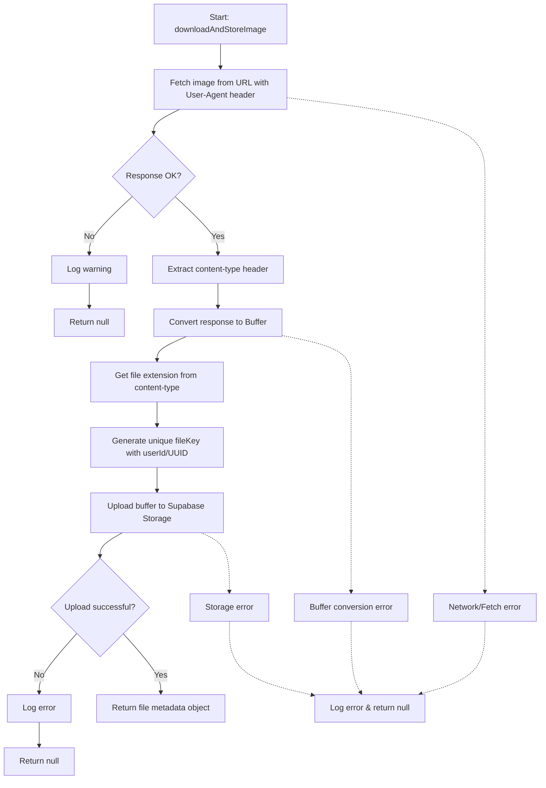

# downloadAndStoreImage

Downloads an image from a remote URL and stores it in Supabase Storage. Returns metadata about the stored file including the storage key, content type, and file size, or `null` if the operation fails.

<details>
<summary>Visual Flow</summary>



</details>

<details>
<summary>Parameters</summary>

- `imageUrl`: `string` - The URL of the image to download. Must be a valid HTTP/HTTPS URL pointing to an image resource.
- `userId`: `string` - The unique identifier for the user. Used to organize files in storage under user-specific directories.
- `supabase`: `SupabaseClient` - An initialized Supabase client instance with access to the storage bucket named "items".

</details>

<details>
<summary>Return Value</summary>

Returns `Promise<{ fileKey: string; contentType: string; size: number } | null>`

**Success case:**
- `fileKey`: `string` - The storage path/key where the file was stored, in format `{userId}/{uuid}{extension}`
- `contentType`: `string` - The MIME type of the stored image (e.g., "image/jpeg", "image/png")
- `size`: `number` - The file size in bytes

**Failure case:**
- `null` - Returned when the download fails, upload fails, or any error occurs during the process

</details>

<details>
<summary>Usage Examples</summary>

```typescript
import { createClient } from '@supabase/supabase-js';

const supabase = createClient('your-url', 'your-key');

// Basic usage
const result = await downloadAndStoreImage(
  'https://example.com/image.jpg',
  'user-123',
  supabase
);

if (result) {
  console.log(`Image stored at: ${result.fileKey}`);
  console.log(`Content type: ${result.contentType}`);
  console.log(`File size: ${result.size} bytes`);
} else {
  console.log('Failed to download and store image');
}

// Handling different image types
const pngResult = await downloadAndStoreImage(
  'https://example.com/avatar.png',
  'user-456', 
  supabase
);

// The function automatically detects content type and applies correct extension
if (pngResult) {
  // fileKey will be something like "user-456/a1b2c3d4-e5f6-7890-abcd-ef1234567890.png"
  console.log(pngResult.fileKey);
}
```

</details>

<details>
<summary>Implementation Details</summary>

The function performs the following operations in sequence:

1. **HTTP Download**: Makes a `fetch` request with a custom User-Agent header identifying the AbodeBot service
2. **Response Validation**: Checks if the HTTP response status indicates success
3. **Content Processing**: 
   - Extracts the `content-type` header, defaulting to "image/jpeg" if not present
   - Converts the response to a `Buffer` for storage
4. **File Organization**: 
   - Determines the appropriate file extension using `getExtensionFromContentType()`
   - Generates a unique file key using the pattern `{userId}/{randomUUID()}{extension}`
5. **Storage Upload**: Uploads the buffer to the "items" bucket in Supabase Storage with `upsert: false` to prevent overwrites
6. **Metadata Return**: Returns an object containing the storage key, content type, and file size

The function includes comprehensive error handling and logging at each step, returning `null` for any failure condition.

</details>

<details>
<summary>Edge Cases</summary>

- **Missing Content-Type**: If the remote server doesn't provide a `content-type` header, defaults to "image/jpeg"
- **Large Files**: No explicit size limits are enforced by this function, but Supabase Storage may have upload limits
- **Invalid URLs**: Network errors or invalid URLs will be caught and logged, returning `null`
- **Duplicate Prevention**: Uses `upsert: false` and random UUIDs to prevent accidental overwrites
- **Non-Image Content**: The function will attempt to process any content type, but assumes image content based on the name and default content type
- **Storage Permissions**: Requires appropriate Supabase storage permissions for the "items" bucket
- **Network Timeouts**: No explicit timeout is set on the fetch request, so it uses the default fetch timeout behavior

</details>

<details>
<summary>Related</summary>

- `getExtensionFromContentType()` - Utility function for determining file extensions from MIME types
- `randomUUID()` - Node.js built-in for generating unique identifiers
- `SupabaseClient.storage` - Supabase storage API for file operations
- `logger` - Application logging utility for error tracking and debugging

</details>