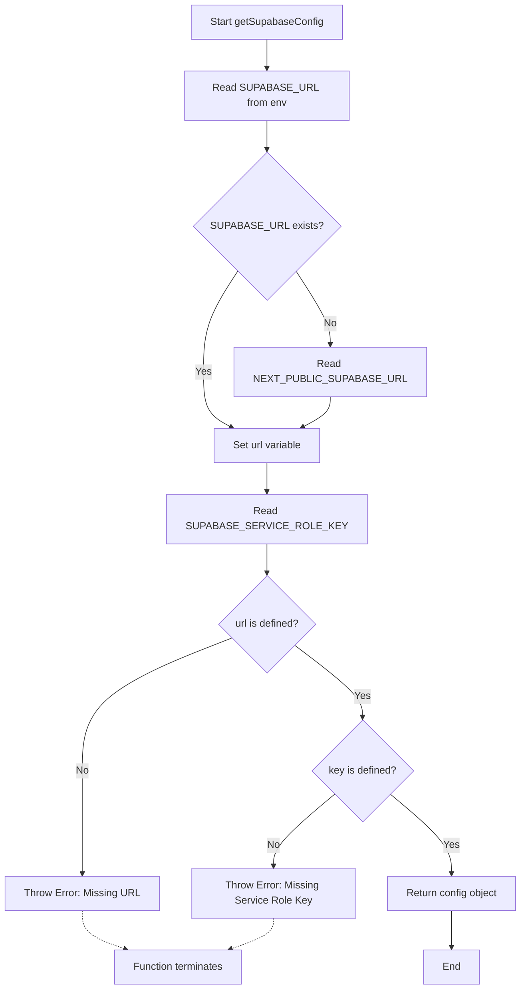

# getSupabaseConfig

Retrieves and validates Supabase configuration from environment variables. This function extracts the Supabase URL and service role key from the environment, with fallback support for Next.js public environment variables, and throws descriptive errors if required configuration is missing.

<details>
<summary>Visual Flow</summary>



</details>

<details>
<summary>Return Value</summary>

Returns an object with type `{ url: string; key: string }` containing:
- `url`: The Supabase project URL from either `SUPABASE_URL` or `NEXT_PUBLIC_SUPABASE_URL`
- `key`: The Supabase service role key from `SUPABASE_SERVICE_ROLE_KEY`

</details>

<details>
<summary>Usage Examples</summary>

```typescript
// Basic usage
try {
  const config = getSupabaseConfig();
  console.log(config.url); // "https://your-project.supabase.co"
  console.log(config.key); // "your-service-role-key"
} catch (error) {
  console.error("Configuration error:", error.message);
}

// Using with Supabase client initialization
import { createClient } from '@supabase/supabase-js';

const { url, key } = getSupabaseConfig();
const supabase = createClient(url, key);

// In a Next.js API route
export default function handler(req, res) {
  try {
    const config = getSupabaseConfig();
    // Use config for server-side operations
  } catch (error) {
    return res.status(500).json({ error: error.message });
  }
}
```

</details>

<details>
<summary>Implementation Details</summary>

The function implements a configuration validation pattern with the following behavior:

1. **URL Resolution**: Uses the nullish coalescing operator (`??`) to provide fallback from `SUPABASE_URL` to `NEXT_PUBLIC_SUPABASE_URL`, supporting both server-side and client-side Next.js environments
2. **Service Role Key**: Only reads from `SUPABASE_SERVICE_ROLE_KEY` (no fallback) as this should be a server-side secret
3. **Validation**: Performs explicit checks for both required values before returning
4. **Error Handling**: Throws specific `Error` instances with descriptive messages that include context about the "classify-url" functionality

The function prioritizes server-side environment variables over public ones, which is appropriate for service role key usage patterns.

</details>

<details>
<summary>Edge Cases</summary>

- **Empty String Values**: The function treats empty strings as valid values (only checks for `null`/`undefined`)
- **Runtime Environment**: May behave differently in server-side vs. client-side Next.js contexts due to environment variable availability
- **Service Role vs. Anonymous Key**: Function specifically requires `SUPABASE_SERVICE_ROLE_KEY`, not the anonymous/public key
- **Error Context**: Error messages specifically mention "classify-url", indicating this function is part of a URL classification system

**Common Pitfalls:**
- Using anonymous key instead of service role key will result in missing key error
- In Next.js, `SUPABASE_URL` may not be available on client-side, hence the `NEXT_PUBLIC_` fallback
- Function throws synchronously - ensure proper error handling in calling code

</details>

<details>
<summary>Related</summary>

- `createClient` from `@supabase/supabase-js` - Typically used with the returned configuration
- Next.js environment variable handling - `process.env` behavior in different contexts
- Supabase authentication patterns - Service role vs. anonymous key usage
- Configuration validation patterns - Similar functions for other service configurations

</details>