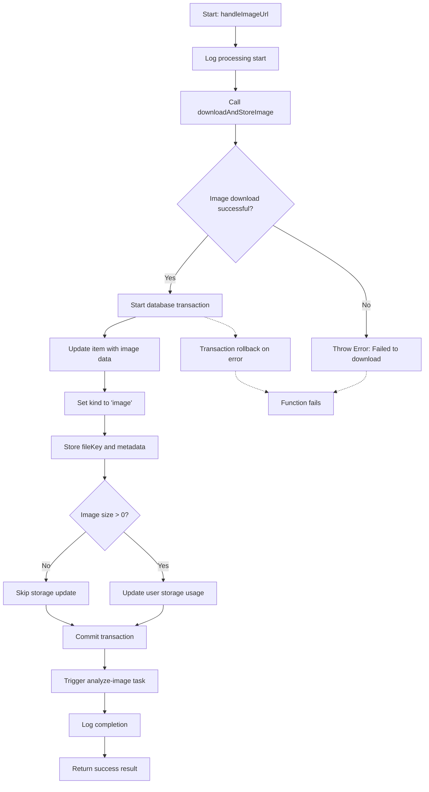

# handleImageUrl

Processes an image URL by downloading the image, storing it in the system, updating the database with image metadata, and triggering image analysis. This function handles the complete workflow for converting a URL-based image into a managed system asset.

<details>
<summary>Visual Flow</summary>



</details>

<details>
<summary>Parameters</summary>

- `itemId: string` - The unique identifier of the item to be updated with the image data
- `userId: string` - The unique identifier of the user who owns the item, used for authorization and storage accounting
- `url: string` - The URL of the image to be downloaded and processed
- `supabase: SupabaseClient` - The Supabase client instance used for storage operations during image download

</details>

<details>
<summary>Return Value</summary>

Returns a `Promise` that resolves to an object with the following properties:

- `success: true` - Always `true` when the function completes successfully
- `itemId: string` - The ID of the processed item (same as input)
- `kind: "image"` - Literal string indicating the item type
- `fileKey: string` - The storage key where the downloaded image is stored

The function throws an `Error` if the image download fails.

</details>

<details>
<summary>Usage Examples</summary>

```typescript
// Basic usage with image URL processing
const result = await handleImageUrl(
  "item_123",
  "user_456", 
  "https://example.com/image.jpg",
  supabaseClient
);

console.log(result);
// Output: {
//   success: true,
//   itemId: "item_123",
//   kind: "image",
//   fileKey: "images/user_456/abc123.jpg"
// }
```

```typescript
// Error handling for failed downloads
try {
  const result = await handleImageUrl(
    "item_789",
    "user_456",
    "https://invalid-url.com/nonexistent.jpg", 
    supabaseClient
  );
} catch (error) {
  console.error("Image processing failed:", error.message);
  // Output: "Failed to download image from URL"
}
```

```typescript
// Processing multiple images sequentially
const imageUrls = [
  "https://example.com/image1.jpg",
  "https://example.com/image2.png"
];

const results = [];
for (const [index, url] of imageUrls.entries()) {
  const result = await handleImageUrl(
    `item_${index}`,
    "user_123",
    url,
    supabaseClient
  );
  results.push(result);
}
```

</details>

<details>
<summary>Implementation Details</summary>

The function orchestrates a multi-step process:

1. **Image Download**: Calls `downloadAndStoreImage()` to fetch the image from the URL and store it in the file system or cloud storage
2. **Database Transaction**: Uses a database transaction to ensure data consistency:
   - Updates the item record with `kind: "image"`, `fileKey`, and metadata including original URL
   - Increments the user's `storageUsedBytes` counter by the image file size
3. **Metadata Storage**: Stores comprehensive metadata in the `meta` field:
   - `size`: File size in bytes
   - `type`: Content type/MIME type of the image  
   - `originalUrl`: The source URL for reference
4. **Async Analysis**: Triggers the `analyze-image` task for background processing of the stored image
5. **Logging**: Provides detailed logging at start and completion for debugging and monitoring

The function uses database transactions to ensure atomicity - if any step fails after the download, the database remains in a consistent state.

</details>

<details>
<summary>Edge Cases</summary>

- **Download Failure**: If `downloadAndStoreImage()` returns `null` or `undefined`, the function throws an error and no database changes are made
- **Zero-byte Files**: Images with size 0 skip the storage accounting update to avoid unnecessary database operations
- **Transaction Failures**: Any database error during the transaction will cause a rollback, but the downloaded file may remain in storage
- **Invalid URLs**: Malformed or inaccessible URLs will cause the download step to fail
- **Authorization**: The function assumes the `userId` has permission to access and modify the specified `itemId`
- **Duplicate Processing**: No built-in protection against processing the same URL multiple times for the same item
- **Large Files**: No explicit size limits are enforced at this level - constraints are handled by `downloadAndStoreImage()`

</details>

<details>
<summary>Related</summary>

- `downloadAndStoreImage()` - Core function for downloading and storing images from URLs
- `analyzeImageTask` - Background task triggered for image analysis and processing
- Database models: `item` and `user` tables for storing image metadata and usage tracking
- `SupabaseClient` - Used for file storage operations during image download

</details>