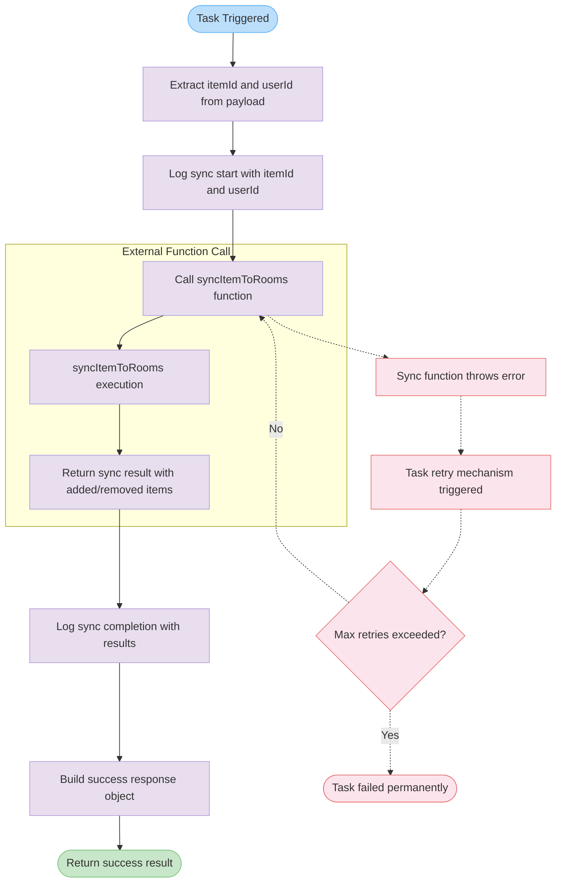

# syncItemToRoomsTask

A background task constant that synchronizes an item to its associated rooms with automatic retry logic and timeout handling. This task executes the core synchronization logic and returns a detailed result including items added and removed during the sync process.

<details>
<summary>Visual Flow</summary>



</details>

<details>
<summary>Parameters</summary>

The task accepts a `payload` parameter of type `SyncItemToRoomsPayload` containing:

- `itemId` (`string`) - The unique identifier of the item to synchronize
- `userId` (`string`) - The unique identifier of the user requesting the synchronization

</details>

<details>
<summary>Return Value</summary>

Returns an object with the following properties:

- `success` (`boolean`) - Always `true` for successful executions
- `itemId` (`string`) - The item ID that was synchronized
- `userId` (`string`) - The user ID that requested the sync
- `added` (`unknown`) - Items/rooms that were added during synchronization
- `removed` (`unknown`) - Items/rooms that were removed during synchronization

The `added` and `removed` properties are spread from the result of the `syncItemToRooms` function call.

</details>

<details>
<summary>Usage Examples</summary>

```typescript
// Triggering the task (typically done by a task scheduler or queue system)
const taskResult = await syncItemToRoomsTask.run({
  itemId: "item_123456789",
  userId: "user_abcdef123"
});

console.log(taskResult);
// Output: {
//   success: true,
//   itemId: "item_123456789",
//   userId: "user_abcdef123",
//   added: [...],
//   removed: [...]
// }
```

```typescript
// Accessing task configuration
console.log(syncItemToRoomsTask.id); // "sync-item-to-rooms"
console.log(syncItemToRoomsTask.maxDuration); // 60 seconds
```

```typescript
// Example of task retry configuration access
const retryConfig = syncItemToRoomsTask.retry;
console.log(retryConfig.maxAttempts); // 3
console.log(retryConfig.factor); // 2
console.log(retryConfig.minTimeoutInMs); // 1000
console.log(retryConfig.maxTimeoutInMs); // 30000
```

</details>

<details>
<summary>Implementation Details</summary>

The task is configured with the following specifications:

- **Task ID**: `"sync-item-to-rooms"` - Used for task identification and monitoring
- **Max Duration**: 60 seconds - Task will timeout if execution exceeds this limit
- **Retry Strategy**: Exponential backoff with jitter
  - Maximum of 3 retry attempts
  - Backoff factor of 2 (doubles wait time between retries)
  - Minimum timeout of 1 second between retries
  - Maximum timeout of 30 seconds between retries

The task execution flow:
1. Extracts `itemId` and `userId` from the payload
2. Logs the start of synchronization with context data
3. Calls the `syncItemToRooms` function with the provided parameters
4. Logs completion with detailed results including added/removed counts
5. Returns a structured response object with success status and sync results

All logging includes contextual information for debugging and monitoring purposes.

</details>

<details>
<summary>Edge Cases</summary>

- **Timeout Handling**: If the `syncItemToRooms` function takes longer than 60 seconds, the task will be terminated
- **Retry Exhaustion**: After 3 failed attempts, the task will fail permanently and no further retries will be attempted
- **Payload Validation**: The task assumes valid `SyncItemToRoomsPayload` structure - invalid payloads may cause runtime errors
- **External Function Failures**: Any errors thrown by `syncItemToRooms` will trigger the retry mechanism
- **Network Issues**: Transient network failures during room synchronization will be handled by the retry logic
- **Concurrent Execution**: Multiple instances of this task with the same `itemId` may lead to race conditions in room synchronization

</details>

<details>
<summary>Related</summary>

- `syncItemToRooms` - The core synchronization function executed by this task
- `SyncItemToRoomsPayload` - Type definition for the task payload structure
- `logger` - Logging utility used for task execution tracking
- `task` - Task creation utility function for defining background jobs

</details>